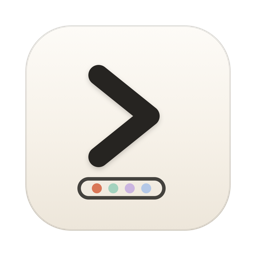

#  AgentBar for Windows

[](LICENSE)


[](https://github.com/michalstrnadel/AgentBar)

**One tray icon for all your AI coding agents.**

AgentBar for Windows is a lightweight, native **system-tray** app that shows the live
state of your AI coding sessions — Claude Code, Codex, Cursor CLI, Gemini CLI, plus
GitHub Copilot and Google Antigravity. Each agent gets its own animated mascot, and the
tray always surfaces the session that needs you most: the moment one asks for
permission, you Allow or Deny it straight from the popover — no terminal switch.

It's the Windows counterpart to [AgentBar](https://github.com/michalstrnadel/AgentBar)
(macOS) and shares the exact same `~/.agentbar` hook protocol — the native UI is written
from scratch in C#/WPF; the Node.js hooks are the same on both platforms.

> **Pre-release.** Every feature below is implemented, but the C# was authored on macOS
> (WPF only compiles on Windows) and hasn't been built or run on a real Windows machine
> yet. First-pass verification is tracked in
> [issue #1](https://github.com/michalstrnadel/AgentBar-Windows/issues/1) — expect to fix
> a few things on the first `./build.ps1`.

## Quick start

Requires the **.NET 8 SDK** and **Node.js** on Windows.

```powershell
git clone https://github.com/michalstrnadel/AgentBar-Windows.git
cd AgentBar-Windows
./build.ps1
./publish/AgentBar.exe
```

1. `AgentBar.exe` starts in the tray and **auto-installs its hooks** for the agents you have.
2. Open a **new** Claude Code session (hooks load at session start) and give it any task.
3. Watch the tray: the mascot animates while the agent works, and the moment it asks for
   permission the icon goes amber — click the tray icon and hit **✓ Allow**, **✓ Always**,
   or **✕ Deny** right in the popover.

That's the whole loop. Details below.

## Features

- **Live status per agent** — an animated mascot plays in the tray while an agent works
  (Clawd the crab for Claude, and the Codex / Copilot / Antigravity marks); a status dot
  is the fallback for agents without artwork.
- **Permission alerts** — the tray icon turns amber the moment an agent waits on you.
- **Multi-session** — every running session listed with project, git branch, and state.
- **Remote Allow / Deny** — answer Claude Code permission prompts from the popover: see
  exactly what's requested (inline mini-diff or full command), then **Allow**, **Always
  allow**, **Deny**, or **Defer** to the terminal.
- **Keystroke approval** — for hookless agents (Codex, Copilot), an *Approve in terminal*
  button focuses the session's terminal and sends the approval key. Best-effort by design.
- **Global shortcut** — opt-in `Ctrl+Alt+A` / `Ctrl+Alt+D` answers the newest pending
  request without even opening the popover.
- **Auto hook-installer** — wires Claude / Codex / Cursor / Gemini configs on launch,
  idempotently, only for the tools you have, and never clobbers an unparseable config.
- **Start at login** — one-click, per-user (no admin, no scheduled task).
- **Built-in updates** — a quiet daily check of GitHub Releases; one click downloads the
  new version, swaps it in, and relaunches.
- **Nothing else** — no window, no taskbar button, no telemetry, no network beyond the
  update check. One process, tiny footprint.

## Requirements

- Windows 10 or 11
- [.NET 8 SDK](https://dotnet.microsoft.com/download) to build (the published exe is
  self-contained and needs no runtime installed)
- Node.js on `PATH` (for the hook scripts) — without it, the Node-based hooks are skipped

## Build & publish

WPF targets `net8.0-windows`, so this **only builds on Windows** (it can be edited
anywhere). `build.ps1` produces a single self-contained exe plus a release zip:

```powershell
./build.ps1                    # -> publish/AgentBar.exe  (+ publish/AgentBar-win-x64.zip)
./build.ps1 -Runtime win-arm64
```

`publish\AgentBar.exe` and the `publish\hooks\` folder beside it are the whole app. The
`AgentBar-<rid>.zip` is the artifact the in-app updater downloads — attach it to a GitHub
release.

> **SmartScreen:** an unsigned exe triggers a warning on first run. Sign it with an
> Authenticode certificate (`signtool`) before distributing, or users click
> "More info → Run anyway".

## Hooks are installed automatically

On every launch the app copies the bundled hook scripts to `%USERPROFILE%\.agentbar\hooks\`
and wires them into each installed agent's config (idempotent — re-run safe, existing
hooks preserved). Local-only: no network, no telemetry.

- **Claude Code** — `<config>\settings.json`, honoring `CLAUDE_CONFIG_DIR` (plus `~/.claude`).
- **Codex** — appends a `notify` entry to `~/.codex\config.toml` **only if you have none**.
- **Cursor** — merges into `~/.cursor\hooks.json` (observational events only).
- **Gemini** — merges into `~/.gemini\settings.json`.
- It records its own path in `%USERPROFILE%\.agentbar\app-path` so a hook can relaunch it.

<details>
<summary>Manual wiring (fallback, if you'd rather do Claude Code yourself)</summary>

In `%USERPROFILE%\.claude\settings.json` (paths are examples):

```json
{
  "hooks": {
    "SessionStart": [{ "hooks": [{ "type": "command", "command": "node \"...\\hooks\\claude\\lifecycle.js\" start" }] }],
    "SessionEnd":   [{ "hooks": [{ "type": "command", "command": "node \"...\\hooks\\claude\\lifecycle.js\" end" }] }],
    "UserPromptSubmit": [{ "hooks": [{ "type": "command", "command": "node \"...\\update.js\" prompt" }] }],
    "PreToolUse":  [{ "hooks": [{ "type": "command", "command": "node \"...\\update.js\" pre" }] }],
    "PostToolUse": [{ "hooks": [{ "type": "command", "command": "node \"...\\update.js\" post" }] }],
    "Stop":        [{ "hooks": [{ "type": "command", "command": "node \"...\\update.js\" stop" }] }],
    "PermissionRequest": [{ "hooks": [{ "type": "command", "command": "node \"...\\permission.js\"" }] }]
  }
}
```

</details>

## Agent support

| Agent | Live status | Mascot | Approve from tray | Notes |
|---|---|---|---|---|
| Claude Code | full | Clawd the crab | Allow / Always / Deny / Defer | hooks: prompt, tool, permission, stop, lifecycle |
| Codex CLI | turn-complete | knot + dot-matrix | keystroke (Enter) | via Codex `notify`; no per-tool granularity upstream |
| Cursor CLI | working / done | pointer | — | hooks in `~/.cursor\hooks.json` (auto-wired if installed) |
| Gemini CLI | working / done | spark | — | hooks in `~/.gemini\settings.json` (auto-wired if installed) |
| GitHub Copilot | — | pixel head | keystroke (`y`+Enter) | no public event API; mascot + keystroke path ready |
| Google Antigravity | — | pixel arch | — | IDE, no CLI hooks; mascot ready |

## Remote Allow / Deny

When a Claude Code session asks for permission, a card appears at the top of the popover:
what's requested (e.g. `Bash: git push origin main`) with an inline **mini-diff / full
command**, plus **✓ Allow**, **✓ Always** (only when Claude Code suggests a rule — echoed
back verbatim), **✕ Deny**, and **⌨ Defer** (fall back to the terminal). Decisions return
through Claude Code's `PermissionRequest` hook, so the terminal prompt never appears — and
if AgentBar isn't running, quits mid-wait, or you ignore the request for 10 minutes
(`AGENTBAR_APPROVAL_TIMEOUT`), the normal terminal prompt shows exactly as before.

**Keystroke approval** — Codex and Copilot have no decision hooks, so a permission-state
session gets an *Approve in terminal* button: AgentBar finds the session's terminal window
(walking the process tree), brings it forward, and sends the approval key. Best-effort —
one window can host many tabs, and it can't reach an elevated terminal from a
non-elevated app.

## How it works

Tiny Node.js hook scripts write one JSON file per session to `%USERPROFILE%\.agentbar\state.d\`.
The app watches that folder and renders. No sockets, no daemons, no network. Permission
approvals use two more folders of the same protocol: the blocking hook writes
`requests.d\`, the app answers into `answers.d\`. This is the same contract the macOS app
uses — only the native UI differs.

## Uninstall

```powershell
# quit AgentBar from the tray first, then:
reg delete "HKCU\Software\Microsoft\Windows\CurrentVersion\Run" /v AgentBar /f  # if "Start at login" was on
rmdir /S /Q "%USERPROFILE%\.agentbar"
# remove the AgentBar hook entries (they all reference \.agentbar\hooks\):
#   %USERPROFILE%\.claude\settings.json (and CLAUDE_CONFIG_DIR) — delete rules whose command contains "\.agentbar\hooks\"
#   %USERPROFILE%\.codex\config.toml    — delete the notify line referencing "\.agentbar\hooks\"
#   %USERPROFILE%\.cursor\hooks.json    — delete entries referencing "\.agentbar\hooks\cursor\"
#   %USERPROFILE%\.gemini\settings.json — delete hook groups referencing "\.agentbar\hooks\gemini\"
```

## Relationship to the macOS app

Separate repo, separate codebase. The two share only the on-disk contract (state JSON
schema + Node hooks) — [AgentBar](https://github.com/michalstrnadel/AgentBar) for macOS,
this for Windows. When the contract changes, both repos' hooks change in lockstep.

## License

MIT — see [LICENSE](LICENSE). Third-party components: see
[THIRD_PARTY_NOTICES.md](THIRD_PARTY_NOTICES.md).
